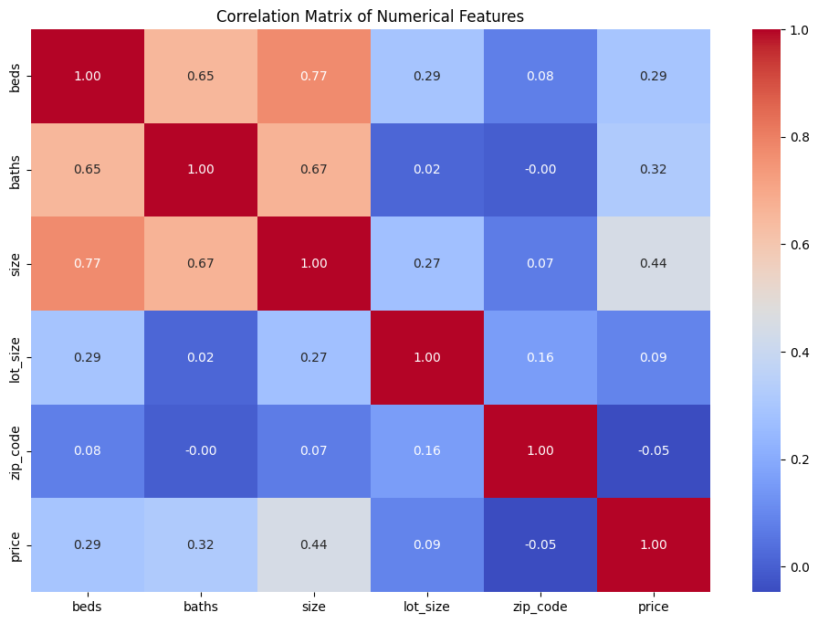
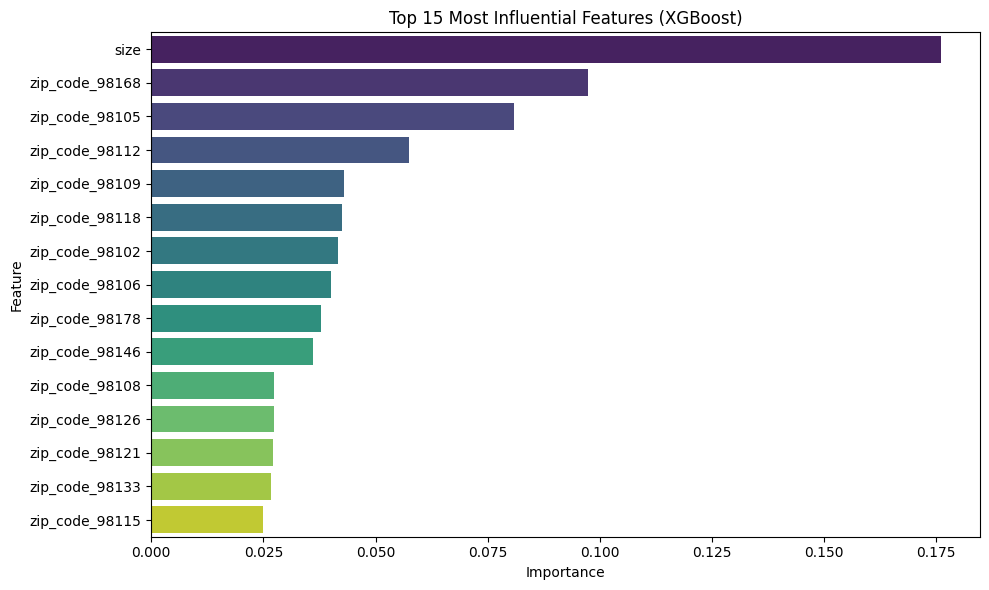

# Seattle Real Estate Price Modeling

## Background & Motivation

This project builds on research I conducted during my master’s internship at Engel & Völkers Seattle, where I analyzed local housing prices using linear regression on NWMLS data. That initial work sparked a deeper interest in modeling real estate trends. With this project, I wanted to revisit that analysis using more advanced methods and publicly available datasets.

This was an opportunity to push my technical modeling further, explore Seattle’s real estate market in detail, and present the results in a structured and insightful way. It also reflects my drive to apply analytical tools to real-world business questions.

## Project Goal

To analyze and predict real estate prices in Seattle using historical housing data, with the aim of identifying key pricing drivers and evaluating the performance of various regression models.

---

## Datasets Used

- `train copy.csv`: Public housing data containing price, size, number of bedrooms, bathrooms, lot size, and ZIP codes.
- `zip-codes.geojson`: Geospatial boundaries for ZIP codes, used for mapping price averages.
- `test copy.csv`: A secondary dataset without price labels, used to simulate how the trained model performs in a real-world scenario. After training and evaluation, the final XGBoost model was used to generate predictions on this unseen test data. While no error metrics could be computed on it directly, it serves as a practical example of model deployment.

All files are included in the repository and used directly in the Jupyter notebook.

---

## Pipeline & Methodology

### Step 1: Data Preparation
- Handled missing values and inconsistent formats
- Renamed and cleaned columns for readability
- Normalized numerical variables
- One-hot encoded ZIP codes for use in models

### Step 2: Exploratory Data Analysis
- Assessed distributions and relationships across variables
- Visualized the correlation matrix:

Notably, the `size` of the property shows a strong positive correlation with `price`, while other features like `beds` and `baths` also contribute, albeit to a lesser extent.

### Step 3: Modeling & Evaluation 📊

I tested three regression models to predict property prices. Here are their results:

| Model           | R² Score | RMSE |
|----------------|----------|------|
| Linear Regression | 0.68     | 0.29 |
| Random Forest     | 0.76     | 0.25 |
| **XGBoost (Final)**   | **0.80** | **0.23** |

After evaluating model performance, XGBoost emerged as the best-performing model, both in accuracy and consistency. It also provides intuitive feature importances.

### Step 4: Feature Importance

Using the fitted XGBoost model, I extracted the most influential features:

The property `size` is by far the most impactful feature, followed by ZIP codes like `98168`, `98105`, `98112`, and others. These spatial patterns offer strong signals in price prediction.

---

## Geospatial Visualizations (Bonus Insight) 🗺️

To enhance the storytelling, I generated a map showing the average property prices by ZIP code using `geopandas` and `folium`. Here's the static version of that map:

This visualization highlights spatial disparities in housing prices across neighborhoods.

A fully interactive version of the map (using `folium`) is also available in the Jupyter notebook. In addition, I experimented with a partial HTML export that focuses on a selection of ZIP codes to improve readability and performance.

---

## Skills Demonstrated

- Data wrangling and cleaning
- Exploratory data analysis and visualization (pandas, seaborn)
- Regression modeling (Linear Regression, Random Forest, XGBoost)
- Model evaluation (R², RMSE)
- Feature importance extraction and interpretation
- Geospatial mapping (GeoJSON, geopandas, folium)

---

## Why This Project Matters

This project allowed me to revisit a real-world pricing problem with more advanced tools and a critical mindset. It reflects my interest in combining business context with technical modeling, going beyond simple regressions to uncover richer insights into market dynamics.

I didn’t just run models—I experimented, validated, and selected based on performance, clarity, and interpretability.

---

## Repository Structure

- `SeattleModelClean.ipynb`: Main notebook with the full pipeline
- `train copy.csv`: Historical housing dataset used
- `test copy.csv`: Test set used for applying the final model
- `zip-codes.geojson`: ZIP code geometries for spatial mapping
- Visual assets used in README:
  - `corrSEml2.png`: Correlation heatmap
  - `xgboostSEml1.png`: XGBoost feature importances
  - `Image 20-04-2025 à 16.12.jpeg`: Static ZIP-code price map
- `README.md`: This documentation

---

## Next Steps 🚀

Further directions could include integrating time-series analysis if updated datasets become available, experimenting with interpretability tools like SHAP, or improving the interactivity of the mapping component.

Thanks for reading!

